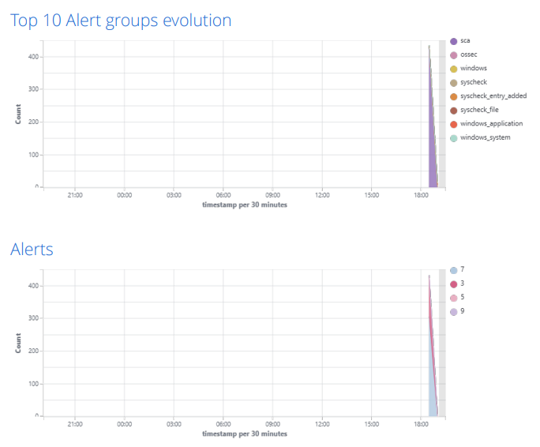
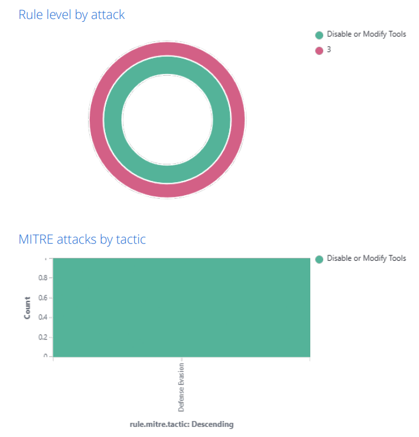
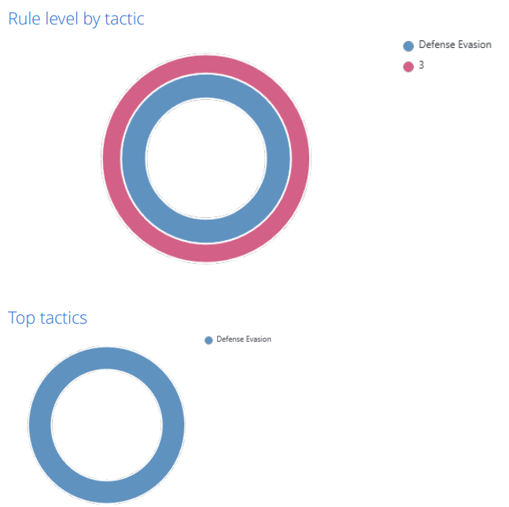
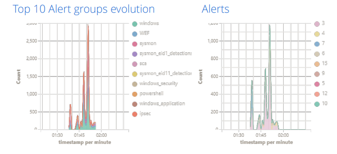
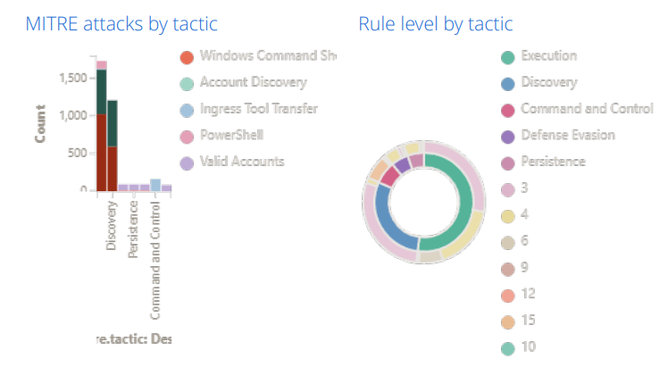
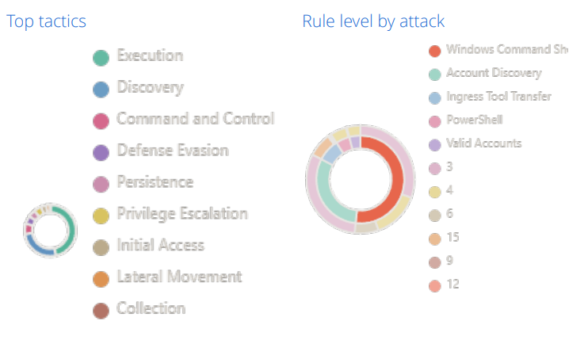

# Homelab: Detecção de Ameaças e Investigação de Incidentes

O homelab segue um cenário de validação de defesas com um dispositivo endurecido (hardening), usando ataques mapeados ao MITRE ATT&CK.

## Índice
 
- [Infraestrutura](#infraestrutura)
- [Metodologia](#metodologia)
- [Mudanças Realizadas (Hardening)](#mudanças-realizadas-hardening)
- [Testes](#testes)

## Sumário
 
- O Defender é eficaz contra ferramentas de ataque conhecidas e não modificadas.
- Comportamentos genéricos do Windows (comandos de descoberta, gravações no registro) não são bloqueados por nenhuma das medidas de hardening aplicadas.
- A detecção baseada em assinaturas tem uma via clara de evasão: ferramentas personalizadas ou execução apenas em memória.
- A cobertura via Sysmon/Sigma é mais orientada a comportamento, e por isso mais duradoura do que depender só de assinaturas de antivírus.
- O ambiente endurecido gerou um volume de logs significativamente maior que a máquina em estado padrão, um custo operacional relevante a se considerar.
- O ambiente não endurecido é relativamente seguro, mas em situações de investigação seja em tempo real ou como forense, deixa a desejar quanto aos dados disponíveis.

## Infraestrutura

**Hardware:**
 
| Componente | Especificação |
|---|---|
| RAM | 16 GB |
| Armazenamento | SSD 480 GB |
| CPU | 4.20 GHz, 6 núcleos |
 
**Máquinas virtuais** (VMware Workstation 26H1):
 
- Ubuntu 24.04.4 Server
- Windows Server 2022 Eval (Domain Controller)
- Windows 10 Enterprise (vítima)

**Software utilizado:**
 
- Wazuh (substituiu o Elastic SIEM por praticidade)
- Atomic Red Team
- Sysmon (config SwiftOnSecurity)
- Hayabusa + Sigma Rules
## Metodologia

O experimento segue o ciclo:
 
```
Limpar logs → Executar ataques → Exportar/Analisar logs → Documentar
```
 
O teste começa em um Windows 10 sem defesas extras e depois é repetido em uma versão endurecida (hardened) da mesma máquina, para comparação direta. Os ataques são executados com o Atomic Red Team, mapeados diretamente a IDs do MITRE ATT&CK, cobrindo diferentes estágios de uma cadeia de ataque. O foco será no comportamento observado na versão endurecida.
 
## Mudanças Realizadas (Hardening)

>Para preparar o Windows 10 a detectar, interromper, realizar
quarentena, e bloquear completamente diferentes tipos de ameaças,
podem ser adicionadas, caso não estejam habilitadas, algumas regras
que agem contra eventos específicos.
É bom mencionar que não existem sistemas 100% seguros, existem vulnerabilidades, bugs, entre outros que podem ser explorados, muitos simplesmente não foram descobertos.
No contexto do homelab, as principais mudanças adicionadas foram
as seguintes:

### Bloquear a técnica padrão do Mimikatz de acesso ao LSASS
 
```powershell
Add-MpPreference -AttackSurfaceReductionRules_Ids 9e6c4e1f-7d60-472f-ba1a-a39ef669e4b2 -AttackSurfaceReductionRules_Actions Enabled
```
 
### Bloquear criação de processos via PSExec e WMI
 
```powershell
Add-MpPreference -AttackSurfaceReductionRules_Ids d1e49aac-8f56-4280-b9ba-993a6d77406c -AttackSurfaceReductionRules_Actions Enabled
```
 
### Bloquear persistência via WMI
 
```powershell
Add-MpPreference -AttackSurfaceReductionRules_Ids e6db77e5-3df2-4cf1-b95a-636979351e5b -AttackSurfaceReductionRules_Actions Enabled
```
 
### Desabilitar o WDigest
 
```powershell
reg add "HKLM\SYSTEM\CurrentControlSet\Control\SecurityProviders\WDigest" /v UseLogonCredential /t REG_DWORD /d 0 /f
```

**Efeito:** o Mimikatz não consegue mais extrair senhas em texto puro do LSASS, apenas hashes NTLM. O ataque Pass-the-Hash ainda é possível com o hash capturado, mas o roubo de credenciais em texto claro é eliminado.
 
### Habilitar a Proteção LSA (RunAsPPL)
 
```powershell
reg add "HKLM\SYSTEM\CurrentControlSet\Control\Lsa" /v RunAsPPL /t REG_DWORD /d 1 /f
```
**Efeito:** o LSASS é executado como um Processo Protegido Leve
(Protected Process Light - PPL), impedindo o acesso direto à
memória. O comando padrão do Mimikatz `sekurlsa::logonpasswords` falha completamente. Para contornar
isso, é necessário um driver de kernel assinado, o que representa
uma barreira muito mais alta.

### Desabilitar LLMNR e NBT-NS
 
Executado via Política de Grupo no domínio (Domain Controller).
 
**Efeito:** elimina ataques de envenenamento de LLMNR/NBT-NS.
 
### Desabilitar SMBv1
 
```powershell
Set-SmbServerConfiguration -EnableSMB1Protocol $false -Force
```
 
**Efeito:** elimina a superfície de ataque para exploits como EternalBlue e alguns downgrades legados de NTLM. Não afeta técnicas modernas de movimentação lateral, mas é uma medida básica de endurecimento.
 
### Restringir o SeDebugPrivilege
 
Via Group Policy no Domain Controller (aplica-se a todo o domínio):
 
```
Configuração do Computador → Configurações do Windows → Configurações de Segurança
→ Políticas Locais → Atribuição de Direitos de Usuário → "Depurar programas"
→ Remover "Administradores"; manter apenas contas específicas, se necessário
```
 
**Efeito:**  O Mimikatz requer o privilégio `SeDebugPrivilege` para acessar
o processo LSASS. Removê-lo de sessões administrativas padrão
adiciona uma camada extra de proteção, complementando o
RunAsPPL. Na prática, isso pode impedir o funcionamento de
algumas ferramentas legítimas de depuração, o que é realista. O
endurecimento de sistemas envolve concessões (trade-offs).

## Testes
 
A análise foi feita de duas formas: em tempo real pelo Wazuh (alertas, logs e mapeamento MITRE ATT&CK) e posteriormente pelo Timeline Explorer, sobre os `.csv` gerados pelo Hayabusa.
 
Wazuh e Hayabusa têm capacidade de detecção e agregação comparáveis, organizando eventos por criticalidade de forma parecida. Não são mutuamente exclusivos: o Wazuh permite reação em tempo real de um analista SOC, enquanto o Hayabusa é mais forte em análise forense *a posteriori*. Útil para investigação, não para reação. Uma diferença notável: algumas tentativas malsucedidas registradas pelo Sysmon foram ignoradas ou parcialmente reconhecidas pelo Hayabusa; nesses casos, prevaleceram os logs do próprio Windows Defender relatando o bloqueio.

### Teste 1: Descoberta
 
**Enumeração de contas de domínio** (`T1087.002`) e **enumeração de máquinas no domínio** (`T1018`)
 
> Resultado: o Windows Defender detectou as *ferramentas* do Atomic Red Team, mas não o comportamento em si, uma limitação clássica da detecção baseada em assinaturas. Um ataque customizado não seria detectado.
 
**Coleta de informações do sistema** (`T1082`)
 
> Resultado: Hayabusa e Wazuh detectaram a atividade, mas não é algo bloqueável, comandos de descoberta usam ferramentas legítimas de amplo acesso.

### Teste 2: Acesso a Credenciais
 
**Dump de memória do LSASS via Mimikatz** (`T1003.001`)
 
> Resultado: detectado e bloqueado imediatamente.
 
**Kerberoasting** (`T1558.003`) e **AS-REP Roasting** (`T1558.004`)
 
> Resultado: nada foi detectado durante a etapa de aquisição de pré-requisitos, mas a execução em si foi interrompida imediatamente, comportamento esperado de um antivírus. Uma implementação customizada de Kerberoasting, ou o Rubeus rodando apenas em memória, provavelmente escapariam da detecção.

### Teste 3: Persistência
 
**Criação de tarefas agendadas** (`T1053.005`)
 
> Resultado: o script apontado pela tarefa foi detectado e bloqueado, mas a criação da tarefa em si, por ser um processo legítimo, não gerou alerta de alto risco.
 
**Chave "Run" do registro** (`T1547.001`)
 
> Resultado: detectado, mas não classificado como malicioso. O Windows Defender não pode bloquear indiscriminadamente gravações na chave Run, já que softwares legítimos a usam constantemente, ele avalia o payload apontado, e se este parecer benigno, o mecanismo de persistência permanece ativo. É exatamente o tipo de cenário que justifica uma regra de detecção dedicada: quando não dá para bloquear de forma limpa, você detecta. Aqui o Hayabusa se mostra mais útil que uma solução de detecção em tempo real, pois oferece um rastro para seguir em uma investigação.

## Visualização dos dados via Wazuh após conclusão dos testes:

### Versão baseline:





### Versão Endurecida:




